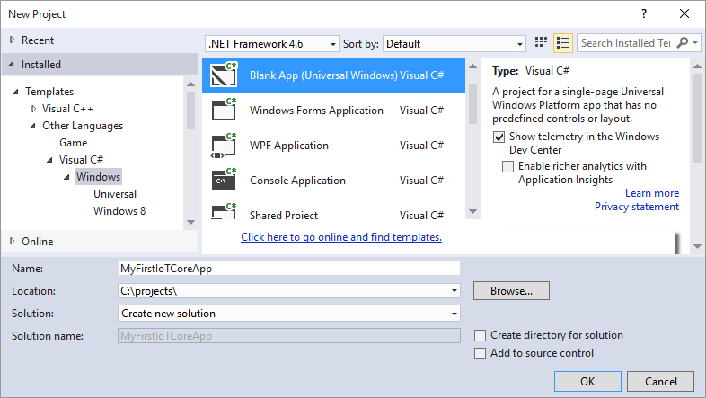

# Connect Your App To Cloud

This step-by-step guide will allow you to familiarize yourself with Windows 10
IoT Core platform, set up your device and create your first application that
connects to Azure IoT Hub.

## Step 1: Prepare your Device

First of all, you need to set up your device.

- If you’re using Raspberry Pi, set up your device according to instructions [here](SetupRPI.htm).
- If you’re using MinnowBoard Max set up your device according to instructions [here](SetupMBM.htm).
- If you’re using Dragonboard setup instructions should come soon [here](GetStarted.htm).

Make sure you provision the TPM of your device as described [here](connect_device_to_cloud.htm)

## Step 2: Install Visual Studio 2015 and Tools

To create Windows IoT Core solutions, you will need to install [Visual Studio
2015](https://www.visualstudio.com/products/vs-2015-product-editions.aspx). You
can install any edition of Visual Studio, including the free Community edition.

Make sure to select the **Universal Windows App Development Tools**, the
component required for writing apps Windows 10:

## Step 3: Install the Connected Services for Azure IoT Hub

The Connected Services for Azure IoT Hub Visual Studio extension allows you to
connect and start interacting with Azure IoT Hub in less than a minute.

You can install the extension from the [VS Gallery](https://aka.ms/azure-iot-hub-vs-cs-vs-gallery).

## Step 4: Create a Visual Studio UWP Solution

To create a UWP solution in Visual Studio, on the **File** menu, click **New** then **Project**:

In the New Project dialog that comes up, select **Blank App (Universal Windows) Visual C#**. Give your project a name, for example **MyFirstIoTCoreApp**:

## Use the Connected Services for Azure IoT Hub to Connect To Azure IoT Hub

Follow the instructions from the [Connected Services tool](https://aka.ms/azure-iot-hub-vs-cs-vs-gallery) to connect your project to Azure IoT Hub. The tool will generate two function, `SendDeviceToCloudMessageAsync` and `ReceiveCloudToDeviceMessageAsync` that you can invoke from anywhere in your app.

The implementations of these functions demonstrate best practices of connecting to the Azure IOT Hub. The code is for you to modify as you see fit.  

